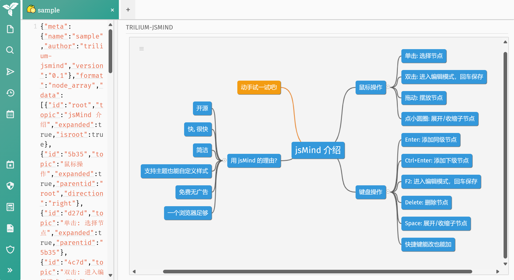
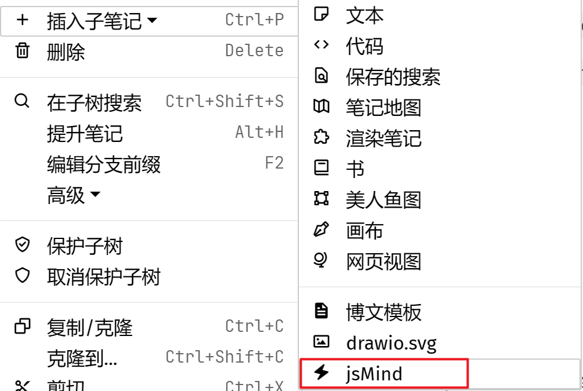
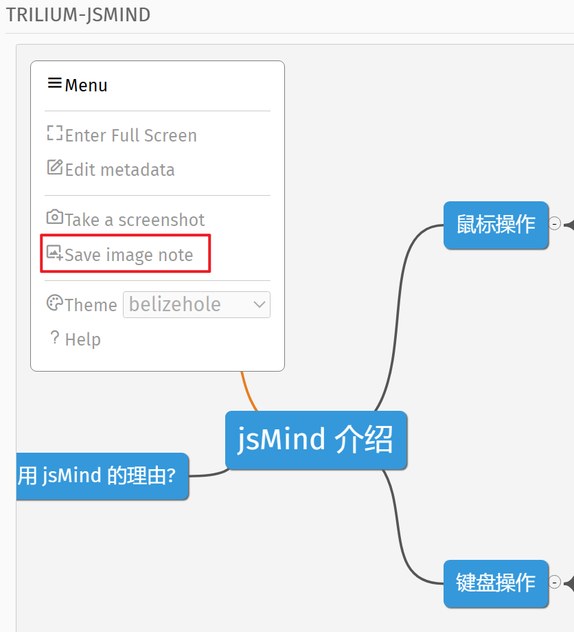
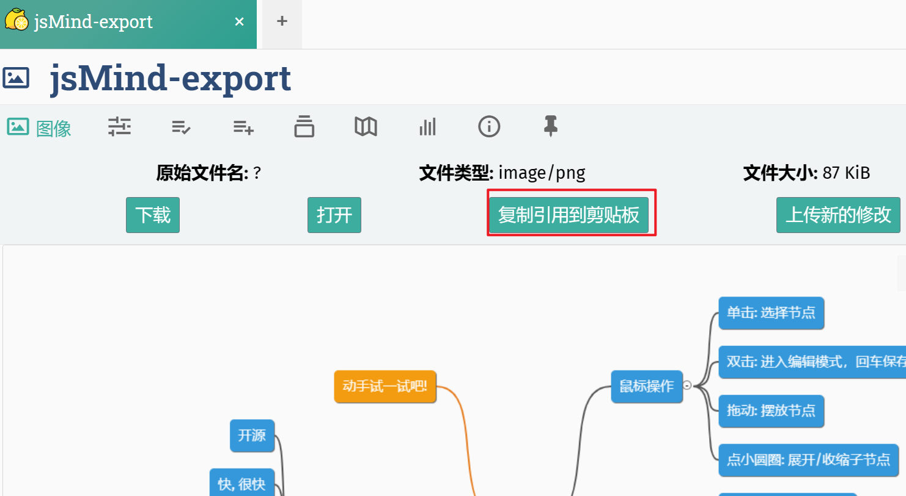
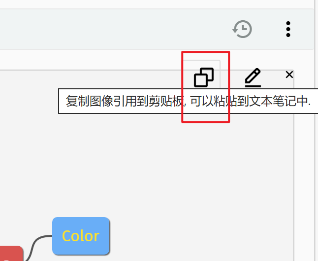
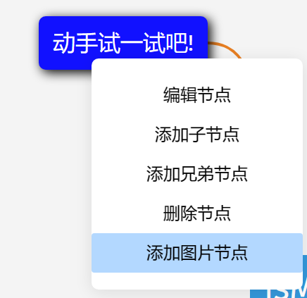
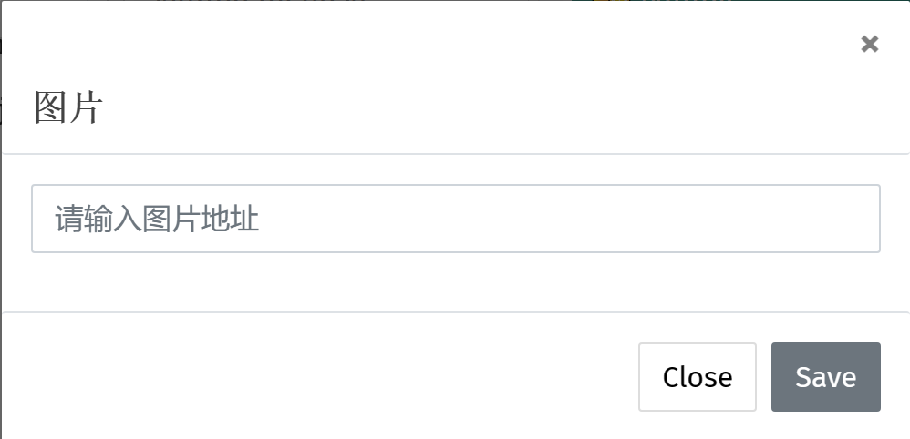
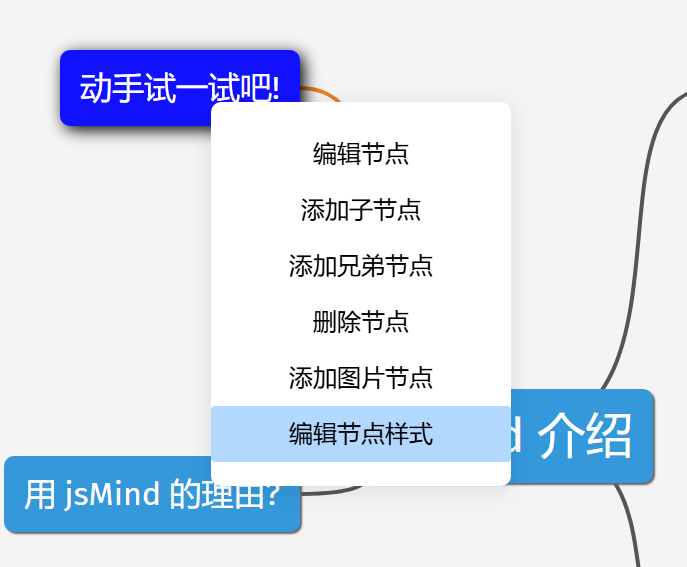
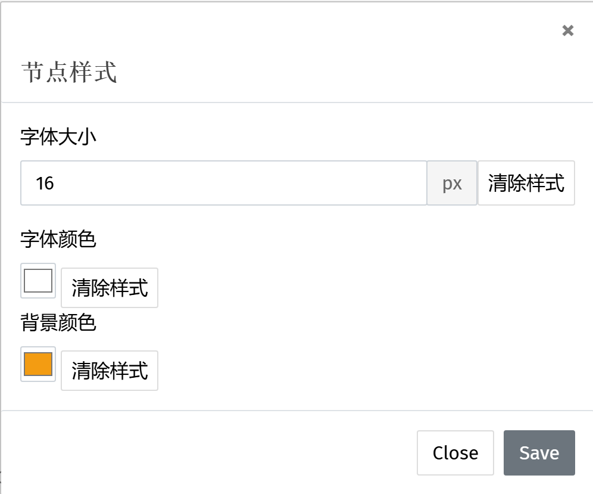

# README
trilium-jsmind
--------------

**此项目已终止维护，建议使用[trilium-simple-mind-map](https://github.com/waterovo/trilium-simple-mind-map)代替**

在trilium创建jsmind思维导图，可以编辑并实时保存 （Trilium 0.63.5）

> 看看这个[trilium-simple-mind-map](https://github.com/waterovo/trilium-simple-mind-map)

使用了以下项目：

[hizzgdev/jsmind](https://github.com/hizzgdev/jsmind)

[allensunjian/jsmind.menu.js](https://github.com/allensunjian/jsmind.menu.js)

### 如何安装

1.  导入笔记，取消勾选安全导入选项（如果您不熟悉trilium的小部件，请谨慎操作）
2.  检查下列笔记是否已经添加标签（默认已经添加）
    1.  TriliumJsmindWidget笔记添加 `#widget` 标签
    2.  template添加 `#jsMindWidgetTemplate` 标签
    3.  css和jsmind.css添加 `#jsMindWidgetCss` 标签
    4.  jsMind笔记添加 `#template` 标签
3.  开始使用

### 如何更新

1.  导入笔记
2.  如果需要保留之前的模板关系，可以保留旧版本的【模板】中的【jsMind】笔记，然后复制新导入的【jsMind】笔记的属性（关系和标签）和内容替换旧版本
3.  旧版本中【jsMind】笔记包含的模板数据可按需保留或修改，其余笔记或数据删除不影响插件，如果确认已经不再需要旧版本，可以进行删除

### 使用说明

#### 如何创建jsMind笔记

#### 如何进行图像引用

因trilium的api限制，本插件通过创建一个图像笔记间接实现图像引用。

点击【Save image note】，会在jsMind笔记下生成一个jsMind-export图像子笔记。

复制引用，插入到其他笔记。

更新完思维导图后，点击【Save image note】会更新jsMind-export图像子笔记，可以看到其他笔记内的引用也更新了。

> v2版本，可以使用右上角的按钮复制图像引用了。
> 
> 

#### 如何启用/关闭右键菜单

在config笔记中，设置SHOW\_MENU=true启用右键菜单，设置SHOW\_MENU=false关闭右键菜单。

#### 如何添加/编辑图片节点

> 要添加/编辑图片节点，请先启用右键菜单

选中节点右键，点击【添加图片节点】

复制图片链接到输入框，点击【Save】

选中图片节点右键，点击【编辑图片节点】可进行图片节点编辑。

#### 如何修改节点样式

> 要修改节点样式，请先启用右键菜单

选中节点右键，点击【编辑节点样式】

编辑完成后，点击【Save】保存修改

#### 如何修改渲染位置

在config笔记中，设置RENDER\_ON=‘note-detail’显示在笔记位置，设置RENDER\_ON=‘right’显示在笔记右侧。

### 正在实现的功能

> 或者待修复的bug

- [x] 新增渲染位置更改的配置，可以将jsMind渲染在笔记区域了
- [x] 调整代码结构
- [x] 节点颜色和文字大小自定义
- [x] 更新右键菜单内容
- [x] 处理domtoimage生成图像模糊的问题
- [x] 添加简单图片节点
- [x] 右键菜单（jsmind.menu.js）
- [x] 图像引用
- [x] 全屏显示
- [x] 记录jsMind主题颜色
- [x] jsMind渲染在笔记右侧

### 版本历史

**v2.0.2（当前版本）**

没有功能更新；修复同步导致的编辑bug。

**v2.0.1**

调整代码结构；新增渲染位置更改的配置，现在可以将jsMind渲染在笔记区域了；添加图像引用浮动按钮。

**v1.1.2**

更新右键菜单内容；样式微调；现在可以对节点颜色和文字大小进行调整了。

**v1.1.1**

更新jsmind；添加jsmind.menu.js插件；实现简单图片节点添加，直接添加图片数据会导致页面卡死，目前只允许添加图片链接；处理domtoimage生成图像模糊的问题。

**v1.1.0**

渲染更改为显示在笔记右侧，更加适配trilium的操作逻辑；无需再配置笔记ID；生成图像子笔记，间接实现图像引用。

**v1.0.0**

验证版本，能够渲染和编辑jsmind。
